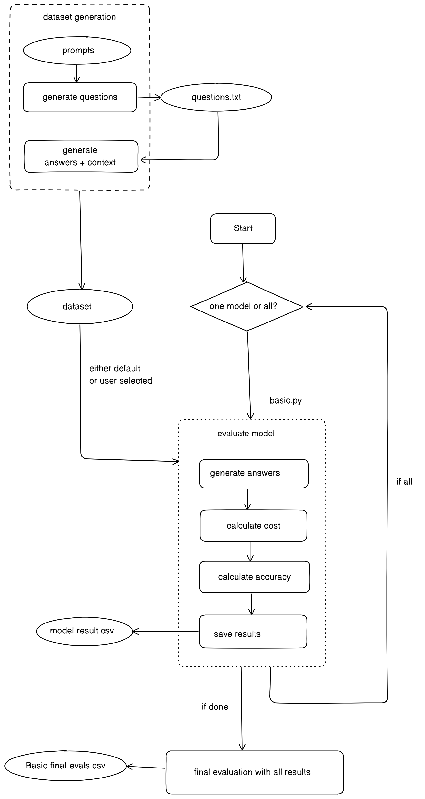

<p align="center">
  <a href="https://enterprisebot.ai/">
    
  </a>
</p>


<p align="center">
  <i>Conversational Automation for Enterprises</i><br/> 
  <a href="https://enterprisebot.ai">enterprisebot.ai</a>
</p>

<h1 align="center">
Benchmarking Enterprise AI
</h1>

<br/>

## Documentation

This documentation provides an overview of the benchmarking tool and how different functions work. 

### Basic Structure

The structure of the benchmarking tool is as follows:





#### 1. Dataset Generation 
- **Prompts**: This is the initial stage where prompts are defined. These prompts are used to generate questions and corresponding answers with context.
- **Generate Questions**: Utilizes the prompts to create questions which are saved in a `questions.txt` file.
- **Generate Answers + Context**: Along with questions, this step generates answers and the context necessary for those answers, assembling a complete dataset.
  
#### 2. Basic.py
- **Evaluate Model**: This is a detailed process encapsulated in a module or function where specific tasks are performed:
  - **Generate Answers**: The model generates answers based on the dataset questions and contexts. Also calculates 
    the time taken for the model to generate answers as well as the number of tokens used which is used for conciseness.
  - **Calculate Cost**: Computes the cost associated with the model's operation, typically based on token usage or API calls.
  - **Calculate Accuracy**: Assesses how accurately the model responded to the questions compared to the expected answers.
  - **Save Results**: Stores the evaluation results for each model in individual CSV files, e.g., `model-result.csv`.

#### 3. Final Evaluation
-**Check Boundedness**: Double-check the results manually to see if they are bounded to the forbidden topics, using the 
guidelines 
from the [BASIC article](https://www.enterprisebot.ai/blog/back-to-basics-a-generative-ai-benchmark-for-enterprise) as a reference.
- **Final Evaluation with All Results**: Aggregates individual model results from the `model-result.csv` files into 
  a final summary file `Basic-final-evals.csv`, which includes comparisons and overall evaluation metrics across all tested models.

Certainly! To make the "Modifications and Customizations" section more practical and user-friendly, I’ll include code samples for some common modifications you might want to make. Here’s how you could expand the section with these examples:


### Modifications and Customizations

Below are several ways you can adapt and customize the script, complete with code samples to guide you:

#### Adjusting Model Evaluations

- **Add or Remove Models**:
  To include a new model or exclude an existing one, update the `available_models` list:
  ```python
  available_models = ["gpt-4", "gpt-3.5-turbo-0125", "new-model-identifier"]
  ```

- **Change API Keys**:
  Modify the environment variables to use different API keys:
  ```python
  import os
  os.environ["OPEN_AI_TOKEN"] = "your-new-openai-api-key"
  ```

#### Modifying Dataset Inputs

- **Change Dataset Path**:
  Point to a different default dataset file:
  ```python
  dataset_path = "path/to/your/new/default/dataset.csv"
  ```


#### Updating Cost Calculation

- **Update Pricing**:
  Adjust the pricing per token for a model:
  ```python
  def calculateModelCost(model, token_usage):
      if model == "new-model-identifier":
          cost = token_usage * 0.00002  # New cost per token
      return cost
  ```

#### Results Handling

- **Custom Output Formats**:
  Change from CSV to JSON output:
  ```python
  import json
  def save_results_to_json(results, filename="results.json"):
      with open(filename, 'w') as f:
          json.dump(results, f)
  ```
